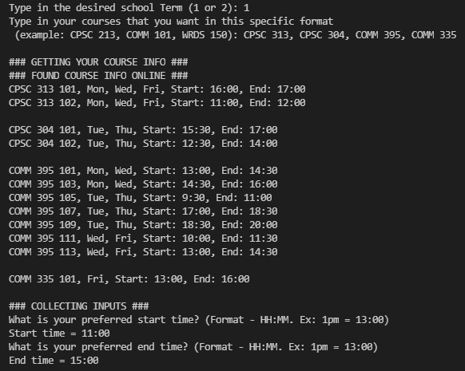
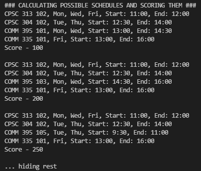
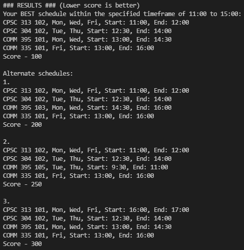

# Perfect Timing

## DESCRIPTION

Perfect Timing is an app that simplifies course regristraion by finding the most optimal schedule for you. As students ourselves, we know the pain of finding the courses we need and fitting them into the times we want. We either can't fit all our required courses in our schedule or have to take them in off-hours because we couldn't find a better combination manually. Perfect Timing automates this process. Simply tell us what courses you want and when, and we'll create a schedule for you so you can take the courses you need at the times you want to!

## THE TEAM
Justin Lui ([LinkedIn](https://www.linkedin.com/in/jlui17), [GitHub](https://www.github.com/jlui17)) - Developer (Scheduling Algorithm)  
Eric Zhou ([LinkedIn](https://www.linkedin.com/in/eric-zhou-050811196/), [GitHub](https://www.github.com/ezhou84)) - Developer (Scheduling Algorithm)  
Jason Liang ([LinkedIn](www.linkedin.com/in/liang-xiao-feng), [GitHub](https://www.github.com/jsr000)) - Developer (Web Scraping/Selenium)  
Brian Park ([LinkedIn](https://www.linkedin.com/in/brian-park-b794aa1b7/), [GitHub](https://github.com/MacTestRun)) - Developer (UX/UI)  

## INSTALLTION
- Setup a virtual env (Optional)
- `pip install -r requirements.txt`

## HOW-TO-RUN
1. Run in terminal `python scheduler.py`
2. Follow the prompts in your terminal!
3. Enjoy your auto-generated schedule :)

## Scoring Explanation

Perfect Timing uses a scoring system to find the best schedule. Every hour of courses that is outside of your desired timeframe equals 100 points. So, if your desired timeframe is 12:00 to 17:00 and the schedule goes from 11:00 to 17:30, the score will be 250. The lower the score, the better the schedule!

## SCREENSHOTS
Inputs  
  

Calculations (Algorithm)  
  

Results  
  